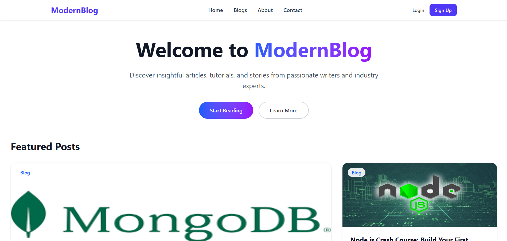
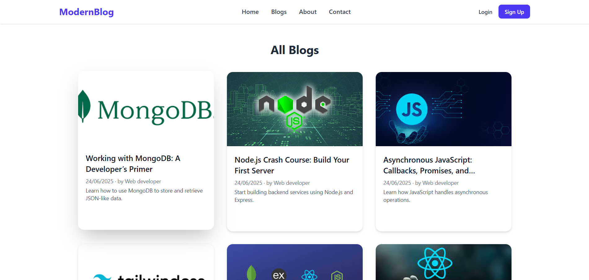
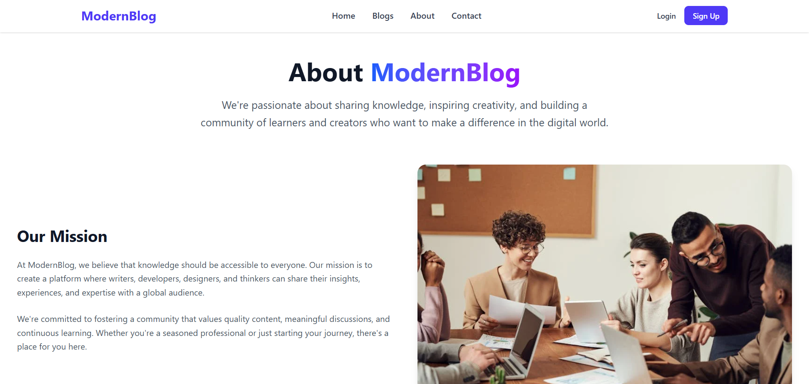
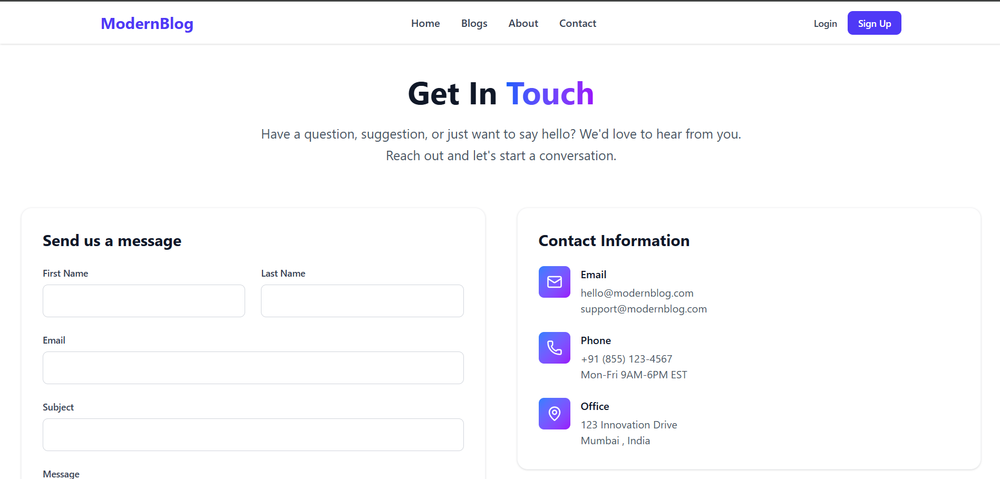
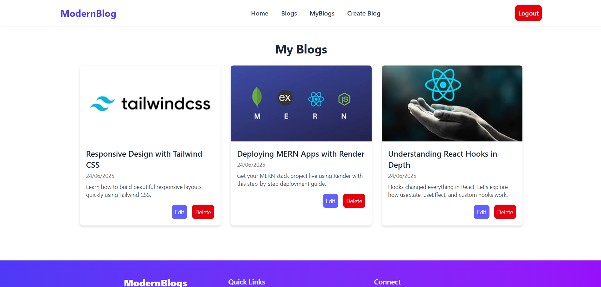
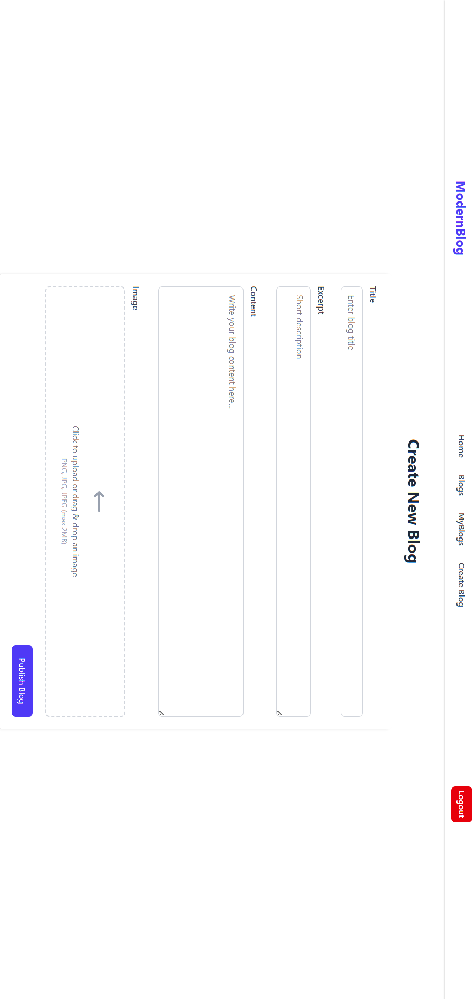

📝 Blog Website

🚀 A Full-Stack Blog Platform built with the MERN stack and styled with Tailwind CSS.
This project allows users to create, edit, and manage blogs with authentication and profile features.

Tech Stack
- Frontend
- React.js
- Tailwind CSS
- Axios (API calls)
- EmailJS (for contact form / notifications)

Backend
- Node.js
- Express.js
- MongoDB + Mongoose
- Multer (for image uploads)
- JWT (JSON Web Token for authentication)

Deployment
- Free hosting services (may take 2–3 seconds to load initially)

Features :
- User Authentication (JWT) & Protected Routes
- Blog Management (Create, Edit, Delete blogs)
- Image Upload for Blogs & Profile
- User Profile Management (name, email, about, profile picture)
- Blog Metadata (author, date, read time)
- Contact Form integrated with EmailJS
- Fully Responsive UI with Tailwind CSS

Installation & Setup :

1. Clone the repository

git clone https://github.com/mahi616/BlogWebsite.git
cd BlogWebsite

2. Install dependencies for backend

cd backend
npm install

3. Install dependencies for frontend

cd frontend
npm install

4. Set up environment variables
Create a .env file in backend/ with:

MONGO_URI=your_mongodb_connection
JWT_SECRET=your_secret_key
EMAILJS_USER=your_emailjs_user
EMAILJS_SERVICE=your_emailjs_service
EMAILJS_TEMPLATE=your_emailjs_template

5. Run the backend

cd backend
npm start

6. Run the frontend

cd frontend
npm run dev

Deployment :

- Frontend deployed on: [Vercel / Netlify / Render]
- Backend deployed on: [Render / Railway / Heroku]

Note: Initial load may take 2–3 seconds due to free hosting.

Screenshots :

- Homepage 

- Blogs

- About

- Contact

- User-Blogs

- Create-Blogs

Learning Outcomes :

- JWT-based authentication
- CRUD operations in MongoDB
- File uploads with Multer
- REST API integration with React
- Tailwind CSS responsive design
- Deployment on free hosting platform

Contact :

Mohit Jodhe

LinkedIn: https://www.linkedin.com/in/mohit-jodhe/

GitHub: https://github.com/mahi616